## Course Information

- Instructor: Po-Shyan Wu
- Email: "poshyanwu@ntu.edu.tw"
- Office: Room 408
- Class time: Mondays 9:10-12:10

## About the Instructor

Research Interests:

- Macroeconomics
- Spatial Economics
- Labor, Development, Economic History

Course I teach:

::: {.incremental}
- [Public Economics]{.fragment .highlight-red}
- Micro and Macro Perspectives of the Labor Market (Wed 3, 4)
- International Finance (Spring 2027)
:::

# Part 1: Introduction

## What do you think it's about? {.smaller}

- tax incidence, optimal tax theory, and how taxes affect labor supply, savings, and corporate behavior
- public goods, education, political economy, redistribution, and social insurance programs
- applying microeconomic tools to government intervention across environmental policy, education, retirement systems, health care, and tax policy
- taxation and efficiency, equity, income/consumption/wealth taxes, tax evasion/compliance
- optimal design of unemployment insurance, disability insurance, and pensions

## These are actual courses {.smaller}

- 14.471 Public Economics I (MIT, Fall 2012, Poterba & Werning)
- 14.472 Public Economics II (MIT, Spring 2004, Gruber & Diamond)
- 14.41 Public Finance and Public Policy (MIT, Fall 2024, Gruber)
- ECON3040 Public Finance
- ECON5059 Tax Theory and Policy
- ECON7170 Topics in Social Security System
<!-- 
- 14.471 Public Economics I (MIT, Fall 2012, Poterba & Werning) — a graduate course on the theory and evidence of government taxation, covering tax incidence, optimal tax theory, and how taxes affect labor supply, savings, and corporate behavior.
- 14.472 Public Economics II (MIT, Spring 2004, Gruber & Diamond) — a graduate course on government spending policy, spanning public goods, education, political economy, redistribution, and social insurance programs like Social Security and health care.
- 14.41 Public Finance and Public Policy (MIT, Fall 2024, Gruber) — an undergraduate course applying microeconomic tools to government intervention across environmental policy, education, retirement systems, health care, and tax policy.
- 11.491J Economic Development, Policy Analysis, and Industrialization (MIT, Fall 2004, Amsden) — a graduate course on why "latecomer" governments intervene to drive industrialization, tracing four stages from launching industry to advancing into high-tech sectors.
- ECON3040 Public Finance — an undergraduate course on government revenue and intergovernmental fiscal adjustment (taxation and efficiency, equity, income/consumption/wealth taxes) framed around current debt-sustainability and fiscal-bailout debates in the US and Japan.
- ECON5059 Tax Theory and Policy — a graduate course working through the theoretical framework of taxation, from excess burden and tax incidence to optimal commodity and income taxation, tax evasion/compliance, and current tax-reform debates.
- ECON7170 Topics in Social Security System — a graduate seminar on optimal design of unemployment insurance, disability insurance, and pensions, built around key papers (Hopenhayn & Nicolini, Kocherlakota, Golosov & Tsyvinski, Grochulski & Kocherlakota). -->

# Syllabus & Schedule

---

---

---

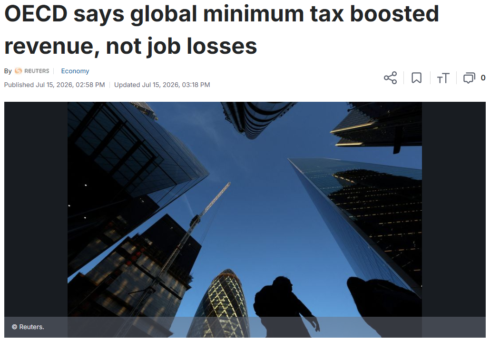

---

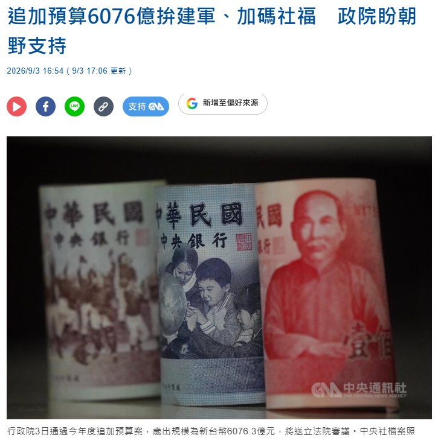

---

---

## What about

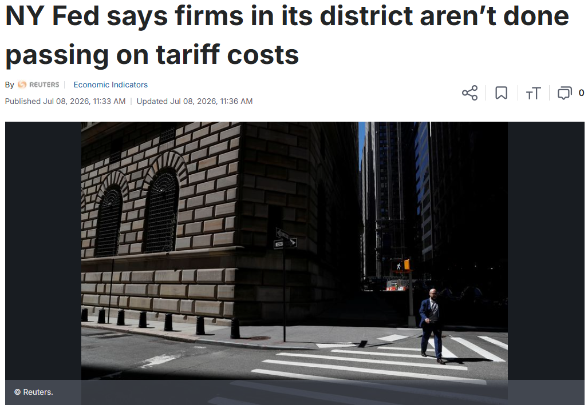

## What about

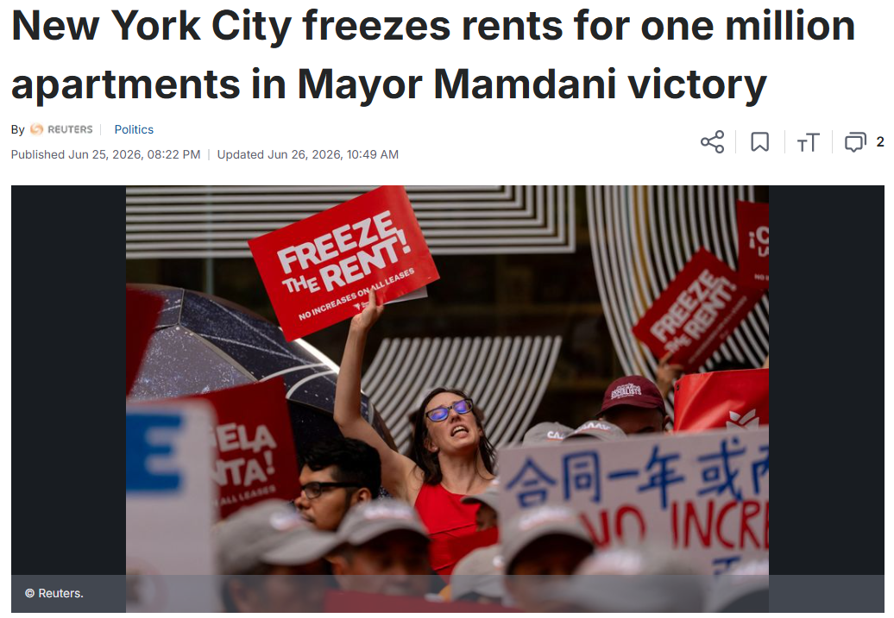

## Our course

Economic approach to public problems

## Structure: On each Monday,

1. Theory (lectures: textbooks)
2. Practice (lectures: papers)
3. Theory + Practice (discussions: content & building toward final project)

## Grading

- Midterm Exam: 25%
- Participation: 25%
- Project (building toward your own policy brief & presenting it): 50%
  - Assignments: 25%
  - Presentation of Final Project: 25%
 
## Textbook

[Stiglitz, Josepf E. and Jay K. Rosengard (2015), Economics of Public Sector, W. W. Norton & Co., 4th](https://wwnorton.com/books/9780393925227)

- Tel: (02) 6632-0088
- email: chiafeng@bkagency.com.tw

## Weekly writing assignments
 
W1 Criteria → W2 Conversation → W3 Analysis → **W4 Memo** → W5 Summarize → W6 Respond → **W7 Bibliography** → W8 Purpose → **W9 Outline** → W10 Audience → **W11 Exec Summary** → **W12 Brief**

## The Process (1/2) {.smaller}
 
1. **W1 Criteria** — what makes a policy brief good
2. **W2 Conversation** — entering the scholarly conversation
3. **W3 Analysis** — analyze structure, vocabulary, and citation in sample papers
4. **W4 Memo** — draft a decision memo
5. **W5 Summarize** — summarize sources accurately
6. **W6 Respond** — three ways to respond to a source
8. (Retrocession Day, Observed)
9. (Midterm Exam)
 
## The Process (2/2) {.smaller}
 
10. **W7 Bibliography** — annotate your sources
11. **W8 Purpose** — what, so what, now what
12. **W9 Outline** — build a sentence outline
13. **W10 Audience** — orient your reader from the start
14. **W11 Exec Summary** — craft an effective executive summary
15. **W12 Brief** — write the final policy brief
16. **Presentation** — present your brief

# Part 2: A little bit of economics

## The Utility Possibilities Curve

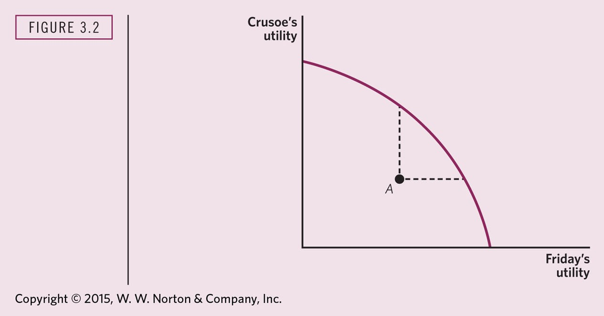

---

## Crusoe's Budget Constraint

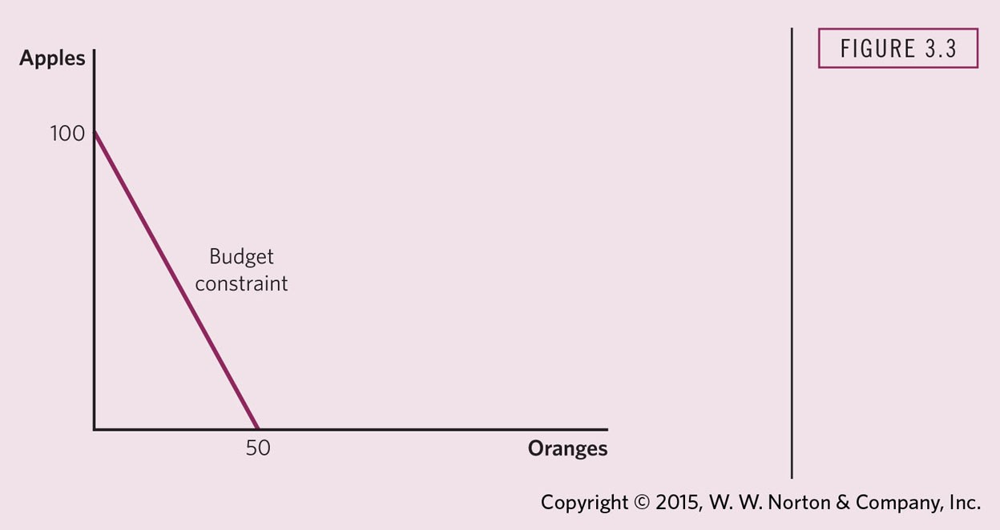

---
 
## The Consumer's Choice Problem

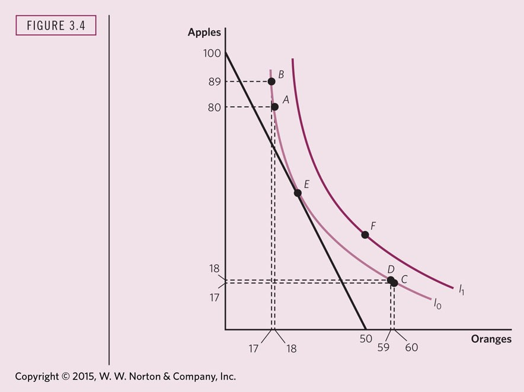

---
 
## Exchange Efficiency

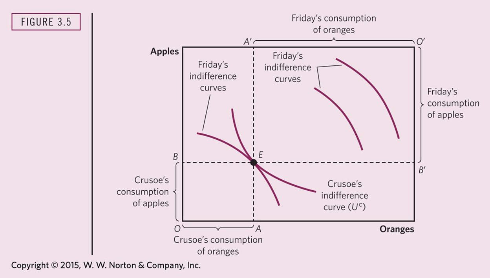

---
 
## Key Terms to Explain (1/2)
 
- **Origin (O and O′)**
- **Endowment point (E)**
- **Indifference curve**
- **Marginal rate of substitution (MRS)**
- **Feasible allocation**
 
---
 
## Key Terms to Explain (2/2)
 
- **Pareto efficient allocation**
- **Contract curve**
- **Pure exchange economy**
- **General equilibrium**

## Production Efficiency and the Production Possibility Frontier

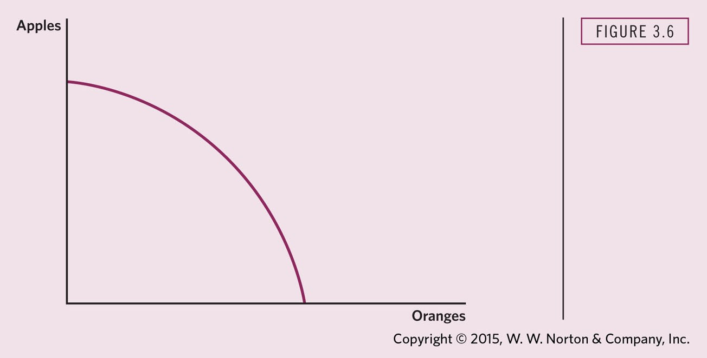

## Isoquants and Iso-cost Lines

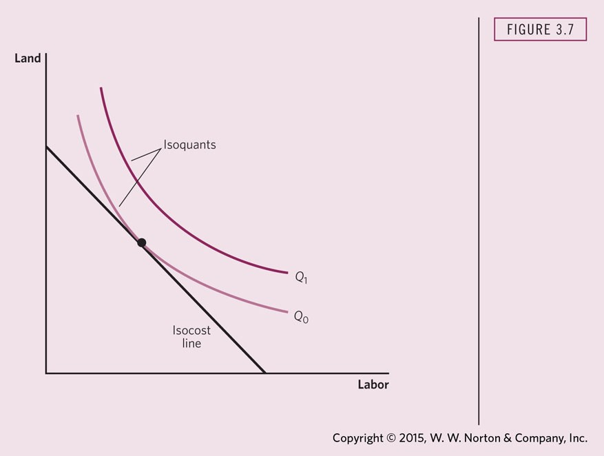

## Production Efficiency

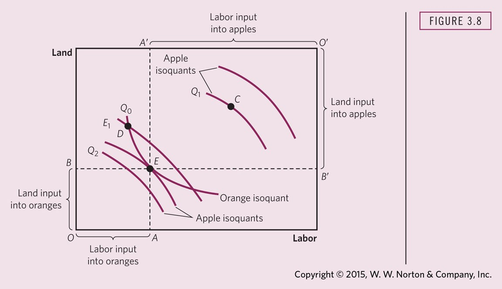

## Production Mix Efficiency

Requires that the Marginal Rate of Transformation (MRT) between two goods in production equals consumers' Marginal Rate of Substitution (MRS) between the two goods in consumption.

# Part 3: Writing and Discussion

## Policy Brief: Some Examples

- [Eliminating Barriers to Job Seekers' Take-Up of Social Benefits in France](https://www.povertyactionlab.org/publication/eliminating-barriers-job-seekers-take-social-benefits-france)
- [Empowering Citizens with Information: Improving Access to Social Assistance in Indonesia](https://www.povertyactionlab.org/publication/empowering-citizens-information-improving-access-social-assistance-indonesia)
- [Assessing Policy Options for Subsidies to Improve the Affordable Care Act](https://www.rand.org/pubs/research_briefs/RB9886.html)
- [A New Approach to Measuring Income Inequality Over Recent Decades](https://www.rand.org/pubs/research_briefs/RBA516-1.html)
- [A Call for Leadership: Persistent State and Local Public Pension Crises Across the United States](https://www.rand.org/pubs/research_briefs/RBA2307-2.html)

## Today

- Eliminating Barriers to Job Seekers' Take-Up of Social Benefits in France
- [Empowering Citizens with Information: Improving Access to Social Assistance in Indonesia](https://www.povertyactionlab.org/publication/empowering-citizens-information-improving-access-social-assistance-indonesia)
- Assessing Policy Options for Subsidies to Improve the Affordable Care Act
- A New Approach to Measuring Income Inequality Over Recent Decades
- A Call for Leadership: Persistent State and Local Public Pension Crises Across the United States